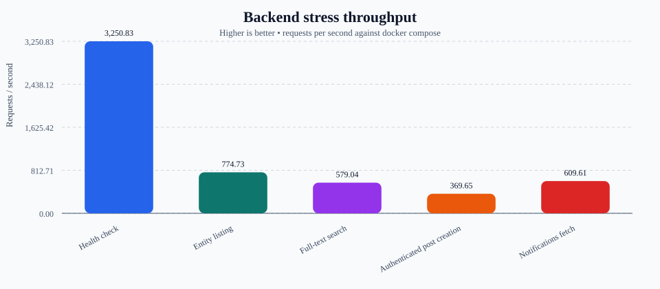
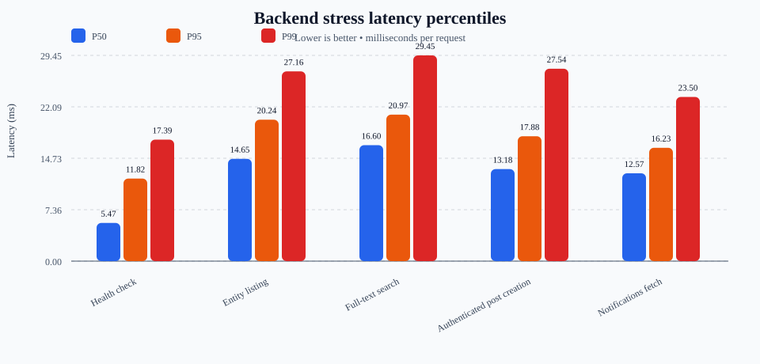

# Backend stress benchmark report

- Generated at: 2026-03-12T16:51:03.246Z
- Stack under test: Docker Compose backend service on `http://localhost:3000`
- Seeded dataset: 24 benchmark entities
- Aggregate requests: 25,461
- Aggregate failures: 0
- Docker image / compose context: docker compose up -d --build
- Node.js: v24.14.0
- Platform: linux (x64)

## Scenario summary

| Scenario | Requests | Req/s | Avg latency (ms) | P95 latency (ms) | Success rate |
| --- | ---: | ---: | ---: | ---: | ---: |
| Health check | 13,025 | 3,250.83 | 6.14 | 11.82 | 100.00% |
| Entity listing | 4,657 | 774.73 | 15.47 | 20.24 | 100.00% |
| Full-text search | 3,484 | 579.04 | 17.24 | 20.97 | 100.00% |
| Authenticated post creation | 1,852 | 369.65 | 13.51 | 17.88 | 100.00% |
| Notifications fetch | 2,443 | 609.61 | 13.11 | 16.23 | 100.00% |

## Charts

### Throughput



### Latency percentiles



## Per-scenario notes

### Health check

- Method / path: `GET` `/api/health`
- Concurrency: 20
- Runtime: 4.01 s
- Requests: 13,025 (13,025 ok / 0 failed)
- Throughput: 3,250.83 req/s
- Latency: avg 6.14 ms · p50 5.47 ms · p95 11.82 ms · p99 17.39 ms · max 74.49 ms
- Statuses: 200: 13,025
- Errors sampled: none

### Entity listing

- Method / path: `GET` `/api/entities?type=post`
- Concurrency: 12
- Runtime: 6.01 s
- Requests: 4,657 (4,657 ok / 0 failed)
- Throughput: 774.73 req/s
- Latency: avg 15.47 ms · p50 14.65 ms · p95 20.24 ms · p99 27.16 ms · max 35.42 ms
- Statuses: 200: 4,657
- Errors sampled: none

### Full-text search

- Method / path: `GET` `/api/research/fulltext?q=benchmark%20entity`
- Concurrency: 10
- Runtime: 6.02 s
- Requests: 3,484 (3,484 ok / 0 failed)
- Throughput: 579.04 req/s
- Latency: avg 17.24 ms · p50 16.60 ms · p95 20.97 ms · p99 29.45 ms · max 35.89 ms
- Statuses: 200: 3,484
- Errors sampled: none

### Authenticated post creation

- Method / path: `POST` `/api/entities`
- Concurrency: 5
- Runtime: 5.01 s
- Requests: 1,852 (1,852 ok / 0 failed)
- Throughput: 369.65 req/s
- Latency: avg 13.51 ms · p50 13.18 ms · p95 17.88 ms · p99 27.54 ms · max 41.50 ms
- Statuses: 201: 1,852
- Errors sampled: none

### Notifications fetch

- Method / path: `GET` `/api/notifications`
- Concurrency: 8
- Runtime: 4.01 s
- Requests: 2,443 (2,443 ok / 0 failed)
- Throughput: 609.61 req/s
- Latency: avg 13.11 ms · p50 12.57 ms · p95 16.23 ms · p99 23.50 ms · max 32.49 ms
- Statuses: 200: 2,443
- Errors sampled: none

## Reproduce

```bash
npm run test:stress-backend
npm run benchmark:report -- --input ./artifacts/benchmarks/<run>.json
```

